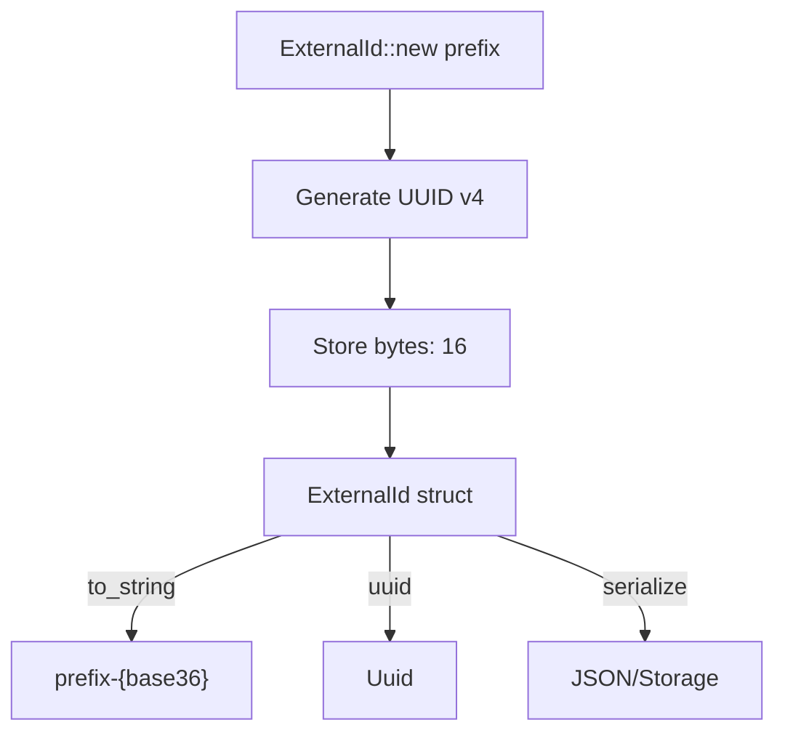

# PRD: External ID (EID) Module

## Overview

The `eid` module provides a simple external ID system combining a human-readable prefix with UUID bytes encoded in base36. It solves the problem of creating identifiable, type-safe external identifiers that are both user-friendly and collision-resistant.

**Primary Goal:** Generate prefixed, unique identifiers in format `prefix-{base36uuid}` for external API exposure.

## Goals

1. **Type Safety** - Prefix indicates entity type (e.g., `user-`, `order-`, `task-`)
2. **Uniqueness** - UUID v4 provides 122 bits of randomness
3. **Readability** - Base36 encoding is shorter than hex, alphanumeric only
4. **Serializability** - Implements Serialize/Deserialize for JSON/storage
5. **Hashability** - Can be used as HashMap keys

## Job Stories

- As a developer, I can create an `ExternalId::new("user")` to generate a unique user ID, so that I can expose it in my API without revealing internal database IDs.
- As a developer, I can call `.to_string()` to get the full prefixed ID, so that I can include it in API responses.
- As a developer, I can access `.uuid()` to get the underlying UUID, so that I can perform UUID-specific operations if needed.
- As a developer, I can serialize/deserialize ExternalId with serde, so that I can store and retrieve IDs from JSON or databases.

## Assumptions

- UUID v4 provides sufficient uniqueness
- Base36 (alphanumeric) is preferred over base64 for URL/filename safety
- Prefix should be stored with the ID for self-describing identifiers
- External dependencies (uuid, serde, base36) are acceptable

## Functional Requirements

```
FR-1: ExternalId::new(prefix) generates new ID with given prefix
- Acceptance: Creates struct with provided prefix and random UUID v4 bytes

FR-2: to_string() returns "prefix-{base36bytes}"
- Acceptance: Format is exactly "{prefix}-{base36_encoded_uuid}"

FR-3: uuid() returns Uuid from stored bytes
- Acceptance: Returns valid Uuid reconstructed from bytes field

FR-4: Display trait implementation
- Acceptance: println!("{}", id) outputs same as to_string()

FR-5: Struct fields are public
- Acceptance: prefix and bytes fields are accessible

FR-6: Implements PartialEq, Eq, Hash
- Acceptance: Can be compared and used as HashMap key

FR-7: Implements Clone
- Acceptance: Can be cloned without consuming original
```

## Non-functional Requirements

```
NFR-1: Serializable with serde
- Acceptance: #[derive(Serialize, Deserialize)] on struct

NFR-2: Debug output available
- Acceptance: #[derive(Debug)] on struct

NFR-3: Bytes stored as fixed array
- Acceptance: Uses [u8; 16] not Vec<u8>
```

## Non-Goals

- Parsing external IDs from strings
- Prefix validation or registry
- Custom UUID versions (only v4)
- Prefix length limits
- Thread-safe generation (each new() creates independent ID)

## Success Metrics

| Metric | Target |
|--------|--------|
| UUID uniqueness | Collision probability < 1 in 2^122 |
| Prefix preservation | 100% of IDs contain original prefix |
| Roundtrip | uuid() returns same UUID used in creation |
| Test coverage | 2+ test cases |

## Technical Constraints

- Depends on: `uuid`, `serde`, `base36` crates
- Currently not exported in lib.rs (needs FR to export)
- Rust edition 2024

## Open Questions

1. Should parsing from string be supported? (Currently not implemented)
2. Should prefix validation be added? (e.g., alphanumeric only, max length)
3. Should the module be exported publicly? (Currently dead code)

## Diagram


