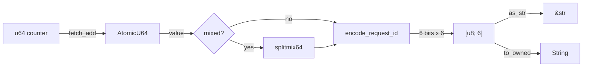

# PRD: Request ID Module

## Overview

The `request_id` module provides a fast, thread-safe request ID generator using a sequential counter mapped to base64-like strings. It solves the problem of generating unique, compact identifiers for request tracing without the overhead of UUIDs or the predictability concerns of plain sequential IDs.

**Primary Goal:** Generate unique, URL-safe, 6-character identifiers with sub-microsecond performance and no heap allocation.

## Goals

1. **Performance** - Sub-microsecond ID generation (~0.001ms per ID)
2. **Compactness** - Fixed 6-character output (vs 36 for UUID)
3. **Zero Allocation** - Returns `[u8; 6]` array, no heap allocation
4. **Thread Safety** - Safe concurrent access via atomic counter
5. **Uniqueness** - 36 bits of counter space (~68 billion unique IDs per generator instance)

## Job Stories

- As a developer, I can create a `RequestIdGenerator` and call `next_id()` to get unique request IDs, so that I can trace requests through my system.
- As a developer, I can use `encode_request_id(n)` directly to convert any u64 to a 6-char ID, so that I can encode existing sequence numbers.
- As a developer, I can use `new_mixed()` to get random-looking IDs, so that sequential patterns are not exposed to end users.
- As a developer, I can convert the `[u8; 6]` output to `&str` using `as_str()`, so that I can use the ID in string contexts without allocation.

## Assumptions

- 6 characters (36 bits) provide sufficient uniqueness for most use cases
- URL-safe characters (A-Z, a-z, 0-9, -, _) are required
- Little-endian byte order in encoding is acceptable
- Single-process uniqueness is sufficient (no distributed coordination)
- Counter wraparound after ~68 billion IDs is acceptable

## Functional Requirements

```
FR-1: encode_request_id(n) encodes u64 to [u8; 6]
- Acceptance: Returns fixed 6-byte array using 64-char URL-safe alphabet

FR-2: encode_request_id_mixed(n) provides randomized-looking output
- Acceptance: Uses splitmix64 mixing function, output differs from plain encoding

FR-3: as_str(&id) converts [u8; 6] to &str
- Acceptance: Returns valid UTF-8 string slice without allocation

FR-4: RequestIdGenerator::new() creates generator starting at 1
- Acceptance: First call to next_id() returns encoding of 1

FR-5: RequestIdGenerator::new_mixed() creates generator with mixing
- Acceptance: Output appears random, not sequential

FR-6: next_id() returns unique ID and increments counter
- Acceptance: Each call returns different value, counter increases by 1

FR-7: next_id_string() returns String
- Acceptance: Returns owned String equivalent to as_str(&next_id()).to_owned()
```

## Non-functional Requirements

```
NFR-1: Thread-safe counter increment
- Acceptance: Uses AtomicU64 with Relaxed ordering

NFR-2: No heap allocation for next_id()
- Acceptance: Returns stack-allocated [u8; 6]

NFR-3: Constant-time encoding
- Acceptance: No loops or branches in encode_request_id()

NFR-4: Default trait implementation
- Acceptance: RequestIdGenerator implements Default, returns new()
```

## Non-Goals

- Distributed uniqueness (no machine ID component)
- Cryptographic randomness
- Decoding IDs back to u64
- Custom alphabet configuration
- Variable-length output

## Success Metrics

| Metric | Target |
|--------|--------|
| Generation time | < 0.01ms per ID |
| Uniqueness | 100% unique for first 100,000 sequential IDs |
| Output length | Exactly 6 characters |
| Character set | All output chars in `[A-Za-z0-9-_]` |
| Test coverage | 5+ test cases |

## Technical Constraints

- No external dependencies (std only)
- Rust edition 2024 (`gen` is reserved keyword)
- Alphabet: `ABCDEFGHIJKLMNOPQRSTUVWXYZabcdefghijklmnopqrstuvwxyz0123456789-_`

## Diagram


